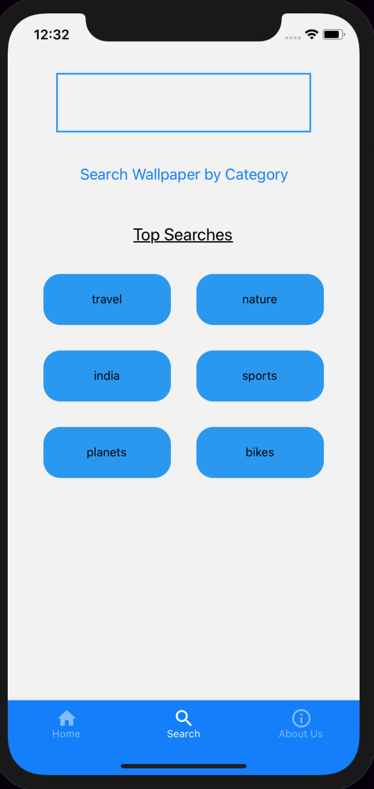
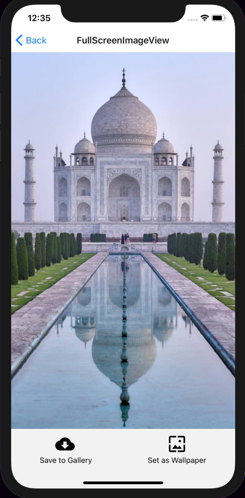

# Wallpaper-React-Native
> A react native based wallpaper app which uses Unsplash Api to fetch the latest wallpapers and lets the user set beautiful images as wallpaper in a single click.The app supports both stack navigation and tab navigation.

Special thanks to  [Vivek Kumar](https://github.com/ogil7190) for his constant support and guidance.

## Features
- [x] Home screen displays a set of random wallpapers.
- [x] Users can search wallpaper according to category along with the most searched tags.
- [x] User can set the image as wallpaper or download it to gallery.

## Screenshots
<table>
    <tr>
        <td> </td>
        <td> </td>
        <td> </td>
    </tr>
</table>

## Dependencies: 
- [react-native-permissions](https://www.npmjs.com/package/react-native-permissions)
- [react-native-fs](https://www.npmjs.com/package/react-native-fs)
- [react-native-vector-icons](https://www.npmjs.com/package/react-native-vector-icons)
- [react-native-wallpaper-manager](https://github.com/liuhong1happy/react-native-wallpaper-manager)